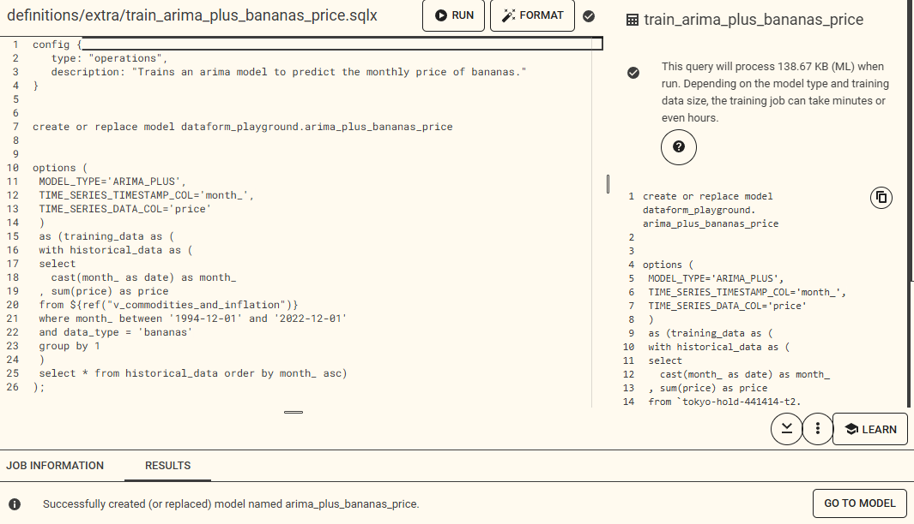
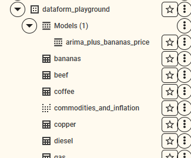
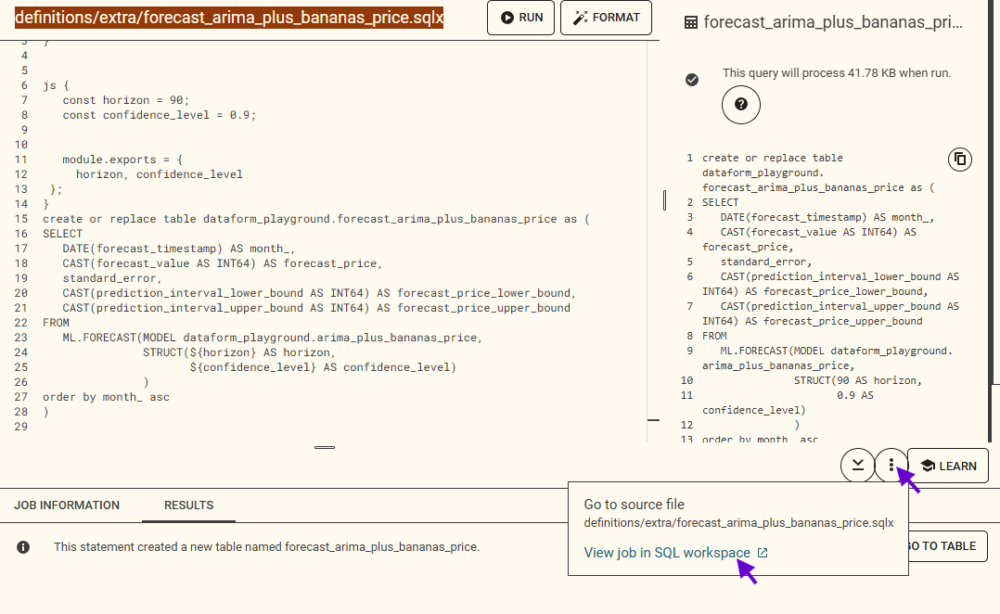
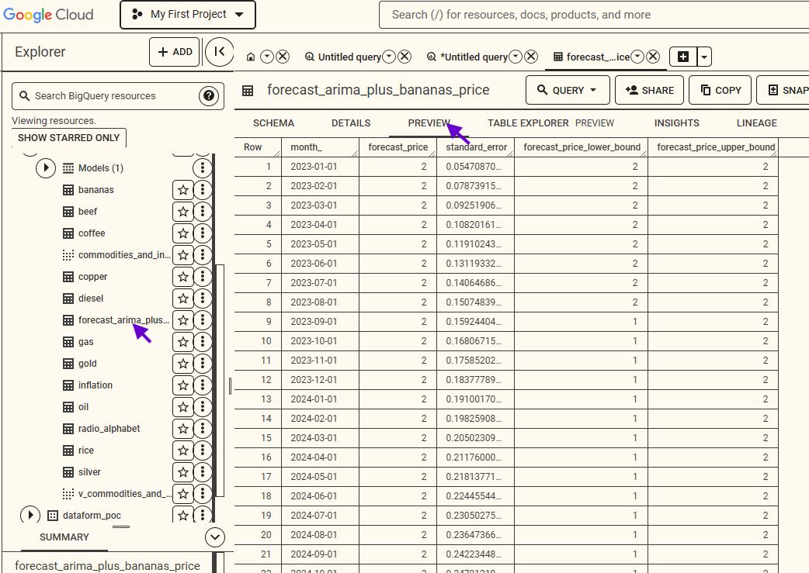
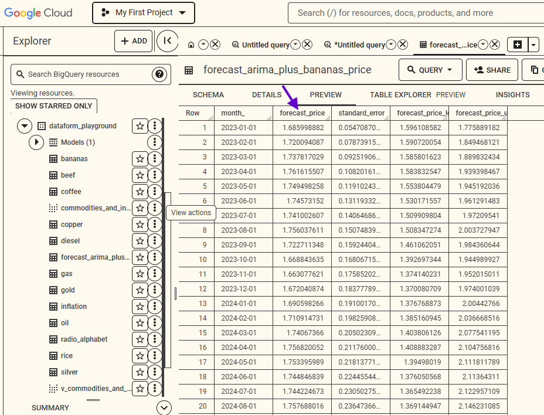

# Newton's BQML Tutorial

This BQML tutorial has a pre-requisite of completing the Dataform tutorial (the [readme.md](https://github.com/shan-alexander/dataform-playground-boilerplate#newtons-dataform-introduction-and-tutorial) file in this repo), in which you'll create the tables and views on which our BQML will depend.

[Pre-requisite Dataform Tutorial](https://github.com/shan-alexander/dataform-playground-boilerplate#newtons-dataform-introduction-and-tutorial)

Alternatively, you can run the create_commodities_tables.sqlx in this repo and _____ file to skip the Dataform tutorial and jump straight into BQML.

## Introduction to BQML

BQML stands for BigQuery Machine Learning (BigQuery ML, or BQML for short). The Google documentation for an intro to BQML is here: [Introduction to AI and ML in BigQuery](https://cloud.google.com/bigquery/docs/bqml-introduction)

In this tutorial, we'll train ML models using only SQL, no Python or other steps. The data will come from our commodities and inflation tables and views, and as a bonus, we'll do it all from Dataform which adds technical excellence but also adds a few nuances.

There's a decent [cheatsheet of BQML syntax on Medium](https://medium.com/fifty-five-data-science/bigquery-machine-learning-cheat-sheet-7c053b21a657), if you'd like to supplement [the official Google Docs](https://cloud.google.com/bigquery/docs/reference/standard-sql/bigqueryml-syntax-create).

## Step 1: Write an Arima Plus model

You can decide whether to create a new Dataform repo for your BQML models, which adds a few steps of tediousness but is more appropriate. For the purposes of a tutorial, however, you can also continue from your existing Dataform repo with the commodities and inflation data.

###### definitions/extra/arima_plus_bananas_price.sqlx
```sql
config {
   type: "operations",
   description: "Trains an arima model to predict the monthly price of bananas."
}


create or replace model dataform_playground.arima_plus_bananas_price


options ( 
 MODEL_TYPE='ARIMA_PLUS',
 TIME_SERIES_TIMESTAMP_COL='month_',
 TIME_SERIES_DATA_COL='price'
 )
 as (training_data as (
 with historical_data as (
 select
   cast(month_ as date) as month_
 , sum(price) as price
 from ${ref("v_commodities_and_inflation")} 
 where month_ between '1994-12-01' and '2022-12-01'
 and data_type = 'bananas'
 group by 1
 )
 select * from historical_data order by month_ asc)
);
```

This ought to successfully train the model.



Notice in BigQuery you now have a model available:



## Step 2: Use the Arima Plus model to forecast

###### definitions/extra/forecast_arima_plus_bananas_price.sqlx
```sql
config {
   type: "operations"
}


js {
   const horizon = 90;
   const confidence_level = 0.9;


   module.exports = {
     horizon, confidence_level
 };
}
create or replace table dataform_playground.forecast_arima_plus_bananas_price as (
SELECT
   DATE(forecast_timestamp) AS month_,
   CAST(forecast_value AS INT64) AS forecast_price,
   standard_error,
   CAST(prediction_interval_lower_bound AS INT64) AS forecast_price_lower_bound,
   CAST(prediction_interval_upper_bound AS INT64) AS forecast_price_upper_bound
FROM
   ML.FORECAST(MODEL dataform_playground.arima_plus_bananas_price,
               STRUCT(${horizon} AS horizon,
                      ${confidence_level} AS confidence_level)
               )
order by month_ asc
);
```

Run the file in Dataform, and in the Results pane, click the three dots and view the job in Big Query:



Now we're cooking. View the table created by the job and click the Preview tab so we can take a look at the data forecasted.



Notice that the forecast is an integer... we made a mistake. We need to forecast with decimal values, as this is the price of bananas per kilogram in USD, so the decimal cents are important.

Change your forecast file to cast the integers to decimals, like this:
```sql
CAST(forecast_value AS decimal) AS forecast_price,
standard_error,
CAST(prediction_interval_lower_bound AS decimal) AS forecast_price_lower_bound,
CAST(prediction_interval_upper_bound AS decimal) AS forecast_price_upper_bound
```

Now check that the table has decimals for the price column.




## Step 3: Duplicate the Arima Plus for correlations

We know from our previous exploration (definitions/extra/commodity_correlations.sqlx) that prices are correlated for bananas & gold (0.917), gold & beef (0.919),  and gold & silver (0.905). 

Let's predict the price of gold.

So we'll use arima plus to forecast the price of bananas, and in a separate model, the price of beef, and a separate model for silver. Then we'll pass the historical data of all four datapoints (gold, bananas, beef, silver) into the Arima XREG model, as well as the forecast data of the three Arima Plus models, and XREG will "solve for x" in which x is the price of gold. And in theory, the XREG model will provide a lower mean error than simply creating an Arima Plus model on the price of gold.

Duplicate your `definitions/extra/arima_plus_bananas_price.sqlx` file for beef, and then again for silver. Duplicate also their forecast scripts.


## Step 4: Create an Arima XREG model


## Step 5: Use the Arima XREG model to forecast

