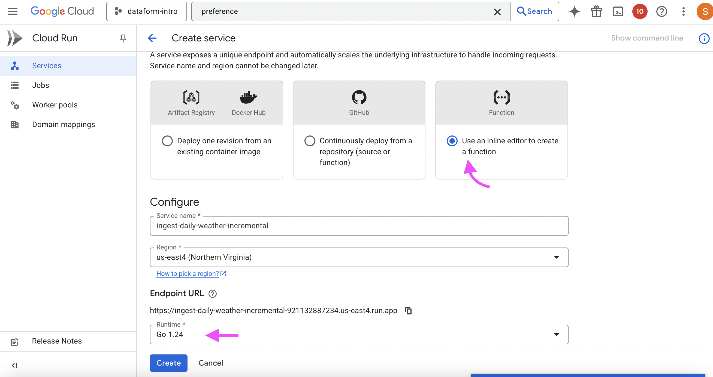
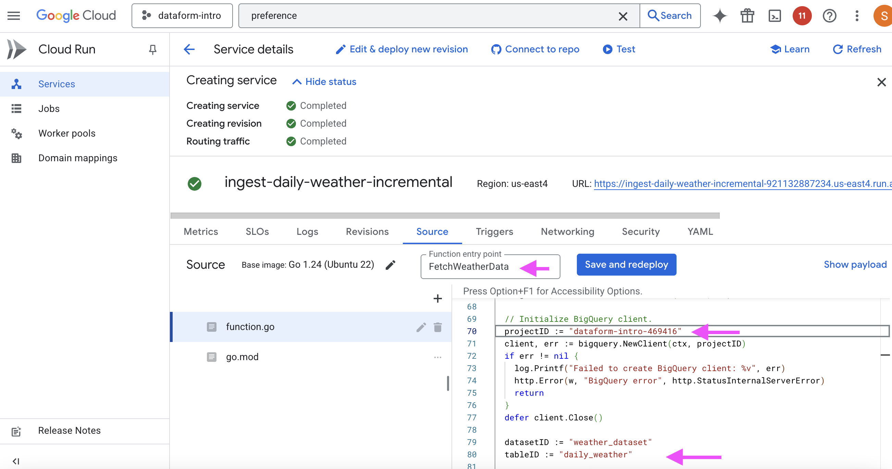

# Cloud Functions

In Google Cloud Platform, Cloud Functions are essentially the equivalent to "AWS lambda". Both serverless. You can ask an LLM for fine-grained differences.

Dataform is great for working with data already in BigQuery, but is not useful for ingesting data from external, 3rd party APIs.

To pull data from 3rd party APIs and ingest into GCP BigQuery, a Cloud Function is a great, cost-effective solution.

## Step 1: Identify the API, Data Schema, & Desired Outcome

In this tutorial, we want to continue using REAL data (all data in the [Dataform](DATAFORM.md) tutorial is real-world data). I've chosen [Open Meteo Historical Weather API](https://open-meteo.com/en/docs/historical-weather-api) for extracting the past 20 years of temperature data.

Specifically, we want the min, max, and mean temperature, and rain and snow amounts, per day.

The API will provide this, free, for a specified coordinate. That means we only gather data for 1 city at a time. We want the following cities:

| City | Latitude | Longitude |
|---|---|---|
| New York City | 40.7128 | -74.0060 |
| Charlotte NC | 35.2271 | -80.8431 |
| Denver CO | 39.7392 | -104.9903 |
| San Francisco CA | 37.7749 | -122.4194 |
| Vancouver Canada | 49.2827 | -123.1207 |
| Rome Italy | 41.9028 | 12.4964 |
| Berlin Germany | 52.5200 | 13.4050 |
| Bogota Colombia | 4.7110 | -74.0721 |
| Lima Peru | -12.0464 | -77.0428 |
| Copenhagen Denmark | 55.6761 | 12.5683 |
| Moscow Russia | 55.7558 | 37.6173 |
| Ho Chi Minh City Vietnam | 10.7626 | 106.6602 |
| Tokyo Japan | 35.6762 | 139.6503 |

Let's review.

**API**:

https://open-meteo.com/en/docs/historical-weather-api

Data to extract per location per day:
- Minimum Temperature
- Maximum Temperature
- Average Temperature
- Sum of Rain
- Sum of Snow

**Data Table Columns**

```sql
CREATE TABLE `your_project_id.your_dataset_id.weather_data` (
    date STRING NOT NULL,
    city STRING,
    latitude FLOAT64 NOT NULL,
    longitude FLOAT64 NOT NULL,
    mean_temperature FLOAT64,
    min_temperature FLOAT64,
    max_temperature FLOAT64,
    rain_sum FLOAT64,
    snowfall_sum FLOAT64,
    inserted_at TIMESTAMP NOT NULL
);
```

**Desired Outcome**:

A Cloud Function that using Golang to extract data from the API, backfill it into a BigQuery table for the past 20 years, but if the table is already backfilled, just ingest the newest data.

## Step 2: Configure the Cloud Function.

Navigate to Cloud Run, and create a function.


Let's call it `ingest-daily-weather-incremental` and use Golang because we love pain.

Set it to allow all access, for simplicity. (Ingress > All: Allow direct access to your service from the internet)



You should now have a Cloud Function with two Golang files.

Note that GCP Cloud Functions will NOT accept a main.go in the root directory, so don't even think about it.

Here's our function.go file (paste this, updating the necessary lines):
```go
package dailyweather

import (
	"context"
	"encoding/json"
	"fmt"
	"io"
	"log"
	"net/http"
	"strconv"
	"time"

	"cloud.google.com/go/bigquery"
	"github.com/GoogleCloudPlatform/functions-framework-go/functions"
	"google.golang.org/api/iterator"
    "cloud.google.com/go/logging"
)

// OpenMeteoResponse defines the structure for the Open-Meteo API response.
type OpenMeteoResponse struct {
	Latitude  float64   `json:"latitude"`
	Longitude float64   `json:"longitude"`
	Daily     DailyData `json:"daily"`
}

// DailyData defines the daily weather data arrays.
type DailyData struct {
	Time              []string  `json:"time"`
	Temperature2mMin  []float64 `json:"temperature_2m_min"`
	Temperature2mMax  []float64 `json:"temperature_2m_max"`
	Temperature2mMean []float64 `json:"temperature_2m_mean"`
	RainSum           []float64 `json:"rain_sum"`
	SnowfallSum       []float64 `json:"snowfall_sum"`
}

// WeatherData represents the schema for BigQuery.
type WeatherData struct {
	City            string    `bigquery:"city"`
	Latitude        float64   `bigquery:"latitude"`
	Longitude       float64   `bigquery:"longitude"`
	Date            string    `bigquery:"date"`
	MeanTemperature float64   `bigquery:"mean_temperature"`
	MinTemperature  float64   `bigquery:"min_temperature"`
	MaxTemperature  float64   `bigquery:"max_temperature"`
	RainSum         float64   `bigquery:"rain_sum"`
	SnowfallSum     float64   `bigquery:"snowfall_sum"`
	InsertedAt      time.Time `bigquery:"inserted_at"`
}

var logClient *logging.Client
var logger *logging.Logger

// init registers the HTTP function.
func init() {
	functions.HTTP("FetchWeatherData", fetchWeatherData)
}

// fetchWeatherData handles the HTTP request, fetches weather data, and stores it in BigQuery.
func fetchWeatherData(w http.ResponseWriter, r *http.Request) {
	ctx := context.Background()
    projectID := "dataform-intro-469416" // change this to your project-id!
    var err error
    logClient, err = logging.NewClient(ctx, projectID)
    if err != nil {
        log.Fatalf("Failed to create logging client: %v", err)
    }
    logger = logClient.Logger("ingest-daily-weather-incremental-logs")

	// Parse query parameters for city, latitude, and longitude.
	city := r.URL.Query().Get("city")
	latStr := r.URL.Query().Get("latitude")
	lonStr := r.URL.Query().Get("longitude")
	if city == "" || latStr == "" || lonStr == "" {
		http.Error(w, "Missing city, latitude, or longitude", http.StatusBadRequest)
		return
	}
	latitude, _ := strconv.ParseFloat(latStr, 64)
	longitude, _ := strconv.ParseFloat(lonStr, 64)

	// Initialize BigQuery client.
	client, err := bigquery.NewClient(ctx, projectID)
	if err != nil {
		log.Printf("Failed to create BigQuery client: %v", err)
		http.Error(w, "BigQuery error", http.StatusInternalServerError)
		return
	}
	defer client.Close()

	datasetID := "weather_dataset"
	tableID := "daily_weather"

	// Query for the max date already in BigQuery for this city/lat/lon.
	maxDateQuery := fmt.Sprintf(`
		SELECT MAX(date) AS max_date
		FROM %s.%s.%s
		WHERE city = '%s' AND latitude = %f AND longitude = %f
	`, projectID, datasetID, tableID, city, latitude, longitude)
	query := client.Query(maxDateQuery)
	// ***error checking***
	log.Printf("Printing client.Query(maxDateQuery):", query)
	it, err := query.Read(ctx)

	if err != nil {
		log.Printf("Failed to query max date: %v", err)
		http.Error(w, "BigQuery query error", http.StatusInternalServerError)
		return
	}

    // ***error checking***
    log.Printf("Printing query.Read(ctx):", it)

	var maxDateStr bigquery.NullString
	for {
		var row struct {
			MaxDate bigquery.NullString `bigquery:"max_date"`
		}
		err := it.Next(&row)

        log.Printf("line 108", err)


		if err == iterator.Done {
			break
		}
		if err != nil {
            logger.Log(logging.Entry{
                Severity: logging.Error,
                Payload:  "BigQuery iteration error 1: " + err.Error(),
            })
			log.Printf("Failed to iterate query results: %v", err)
			http.Error(w, "BigQuery iteration error 0", http.StatusInternalServerError)
			return
		}
		if row.MaxDate.Valid {
			// ***error checking***
			log.Printf("line118 check")
			maxDateStr = row.MaxDate
		}
	}

	// Determine start_date: If max_date exists, start from next day; else, 20 years ago.
	endDate := time.Now().Format("2006-01-02")
	var startDate string
	if maxDateStr.Valid {
		maxDate, _ := time.Parse("2006-01-02", maxDateStr.StringVal)
		startDate = maxDate.AddDate(0, 0, 1).Format("2006-01-02")
	} else {
		startDate = time.Now().AddDate(-20, 0, 0).Format("2006-01-02")
	}

	// If start_date > end_date, no new data to fetch.
	if startDate > endDate {
		fmt.Fprintf(w, "No new data to insert for %s", city)
		return
	}

	// Fetch weather data from Open-Meteo.
	apiURL := fmt.Sprintf(
		"https://archive-api.open-meteo.com/v1/archive?latitude=%f&longitude=%f&start_date=%s&end_date=%s&daily=temperature_2m_min,temperature_2m_max,temperature_2m_mean,rain_sum,snowfall_sum&timezone=auto",
		latitude, longitude, startDate, endDate,
	)
	resp, err := http.Get(apiURL)
	if err != nil {
		log.Printf("Failed to make HTTP request: %v", err)
		http.Error(w, "Failed to fetch data", http.StatusInternalServerError)
		return
	}
	defer resp.Body.Close()

	if resp.StatusCode != http.StatusOK {
		body, _ := io.ReadAll(resp.Body)
		log.Printf("Open-Meteo API returned status %d: %s", resp.StatusCode, string(body))
		http.Error(w, "API error", http.StatusInternalServerError)
		return
	}

	body, err := io.ReadAll(resp.Body)
	if err != nil {
		log.Printf("Failed to read response body: %v", err)
		http.Error(w, "Failed to read data", http.StatusInternalServerError)
		return
	}

	var meteoResp OpenMeteoResponse
	if err := json.Unmarshal(body, &meteoResp); err != nil {
		log.Printf("Failed to unmarshal JSON: %v", err)
		http.Error(w, "Failed to parse data", http.StatusInternalServerError)
		return
	}

	if len(meteoResp.Daily.Time) == 0 {
		log.Printf("No data returned from API")
		http.Error(w, "No data available", http.StatusNoContent)
		return
	}

	// Prepare data for BigQuery.
	var weatherData []*WeatherData
	for i := 0; i < len(meteoResp.Daily.Time); i++ {
		entry := &WeatherData{
			City:            city,
			Latitude:        meteoResp.Latitude,
			Longitude:       meteoResp.Longitude,
			Date:            meteoResp.Daily.Time[i],
			MeanTemperature: meteoResp.Daily.Temperature2mMean[i],
			MinTemperature:  meteoResp.Daily.Temperature2mMin[i],
			MaxTemperature:  meteoResp.Daily.Temperature2mMax[i],
			RainSum:         meteoResp.Daily.RainSum[i],
			SnowfallSum:     meteoResp.Daily.SnowfallSum[i],
			InsertedAt:      time.Now(),
		}
		weatherData = append(weatherData, entry)
	}

	// Insert data into BigQuery.
	inserter := client.Dataset(datasetID).Table(tableID).Inserter()
	if err := inserter.Put(ctx, weatherData); err != nil {
		log.Printf("Failed to insert data: %v", err)
		http.Error(w, "Failed to store data", http.StatusInternalServerError)
		return
	}

	fmt.Fprintf(w, "Successfully inserted %d rows for %s into BigQuery", len(weatherData), city)
}

// main is only for local testing, not for the cloud function
func main() {
	// Start the HTTP server on port 8080.
	// Use functions-framework-go to run locally.
	log.Printf("ran the main function for testing")
}
```
> [!WARNING]
> Make sure you change the projectID variable to your project ID.

Our entry point is `FetchWeatherData` so input that in the GCP console.



Make sure you've already created the BigQuery dataset and table, too.

The `go.mod` file should look like this:

```go
module example.com/gcf

require (
  github.com/GoogleCloudPlatform/functions-framework-go v1.9.0
  cloud.google.com/go/bigquery v1.61.0
)
```

Now you can `Save and Deploy`. If it fails to build, visit the logs and Cloud Logging to identify the problem. Upon successfully building (it will take a few minutes on a free tier), you'll see green checks. The URL and location of the endpoint are provided in the middle of the screen, very handy!


Test the cloud function using the Cloud Shell terminal, replacing `your-function-trigger-url` with the endpoint shown in the console:

```
curl "https://your-function-trigger-url?city=New%20York%20City&latitude=40.7128&longitude=-74.0060"
```

The Cloud Shell should log the message: `Successfully inserted 7306 rows for New York City into BigQuery`.

If you are stuck and don't know your function's trigger URL, you can run this command, replacing the region and project parameters with your values:

```
gcloud run services list --region=us-east4 --project=dataform-intro-469416
```

## Step 3: Setup Cloud Composer & the DAG

**Overview**

Cloud Composer: Enable the Cloud Composer API in GCP. Then create a new environment.

DAG Design: Define a DAG that iterates over the city list, creating a task for each city to trigger the Cloud Run function.

Authentication: Use a service account with permissions to invoke the Cloud Run function and access BigQuery.

Scheduling: Set the DAG to run daily, with no catch-up to avoid redundant runs.

Deployment: Upload the DAG to the /dags folder in the Cloud Composer environment’s Cloud Storage bucket.

I've decided to move the Composer steps to it's own walkthrough file. Head over to (COMPOSER_AIRFLOW.md)[COMPOSER_AIRFLOW.md] to continue the journey.
