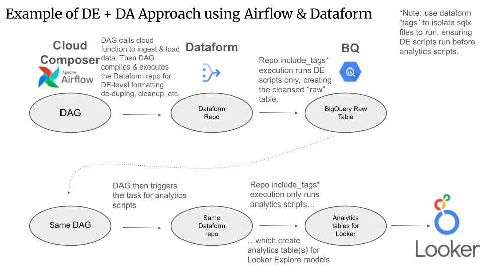

# Newton's Dataform tutorial

## Introduction

Many teams and companies are unsure of Dataform's intended use. Dataform is for the **Transform** layer in ELT (**E**xtract from api, **L**oad into data warehouse, **T**ransform into analytics tables for insights, dashboards, etc). If we are planning to use Airflow DAGs (GCP Cloud Composer) for handling API calls to ingest data, then we have the full ELT covered (Airflow for Extract and Load, Dataform for Transform).

Here's an example of how that may look:



In the example above, there is 1 dataform repo for Google Analytics. The airflow DAG:
1. First ingests data from an external API
2. Then compiles the Dataform repo
3. Runs the SQLX files with the data_engineering tag
4. Runs the SQLX files with the business_analytics tag

Before we deep-dive into applied uses of Dataform, we need to understand this Airflow DAG layer, so we can better understand how to approach Dataform.

Let's look at a psuedo-code example of an Airflow DAG using python. In this example, the DAG will ingest Google Analytics data from an API, store it in Google Cloud Storage as a JSON file, then load the new data into BigQuery, then compile the Dataform repo, execute the "data_engineering" tagged SQLX files first, followed by the "analytics_engineering" SQLX files.

>[!NOTE]
> DAGs are most commonly written in Python, but can be written in other languages. The new kid on the block for data engineering backends is Golang, for efficiency & concurrency. We'll stick to Python for now, for readability & simplicity.

```python
from __future__ import annotations

import pendulum
from datetime import date, timedelta
import random
import json

from airflow.models.dag import DAG
from airflow.operators.python import PythonOperator
from airflow.providers.google.cloud.operators.bigquery import BigQueryLoadJobOperator
from airflow.providers.google.cloud.operators.dataform import (
    DataformCreateCompilationResultOperator,
    DataformCreateWorkflowInvocationOperator,
)
from airflow.providers.google.cloud.transfers.gcs_to_bigquery import GCSToBigQueryOperator
from airflow.providers.google.cloud.hooks.gcs import GCSHook

# --- Configuration Variables ---
PROJECT_ID = "your-gcp-project-id"
LOCATION = "your-dataform-location"
REPOSITORY_ID = "your-dataform-repository-id"
GIT_COMMITISH = "main"

# BigQuery settings for the ingestion table
BQ_DATASET = "your_raw_ga_dataset"
BQ_TABLE = "raw_ga_events"

# GCS settings for the landing zone
GCS_BUCKET = "your-gcs-bucket"
GCS_INGEST_PATH = "ga_data/events"

# Backfill date range, we could make the DAG idempotent or incremental but we'll keep it simple for now.
START_DATE = date(2025, 1, 1)
END_DATE = date(2025, 1, 31)

# Generate and upload data to GCS
MOCK_API_BASE_URL = "https://example.com/api"

# Function definition to simulate API call and upload data to GCS
def generate_and_upload_data_to_gcs(execution_date: date, **kwargs):
    """
    Simulates fetching high-volume data from an external API and uploads it
    as a JSON file to Google Cloud Storage (GCS).
    """
    gcs_hook = GCSHook(gcp_conn_id="google_cloud_default")
    ds = execution_date.strftime("%Y-%m-%d")

    # API Call
    print(f"Calling API endpoint: {MOCK_API_BASE_URL}/posts?_limit=100")
    try:
        response = requests.get(f"{MOCK_API_BASE_URL}/posts?_limit=100")
        response.raise_for_status()  # Raise an exception for bad status codes (4xx or 5xx)
        api_data = response.json()
    except requests.exceptions.RequestException as e:
        print(f"Error calling API: {e}")
        # In a production DAG, we'd handle this error more gracefully, perhaps by retrying or sending a notification. We'd also import a Google Cloud Logger library, instead of a Pythonic print().
        raise

    # Transform API data into a format suitable for BigQuery ingestion
    # For this example, we'll mock some GA events, store in an array of objects (a list of json-formatted dictionaries in python) and simulate uploading to GCS.
    json_lines = []
    num_records = len(api_data) * random.randint(1, 5) # Simulate varying record counts
    for i in range(num_records):
        # Create a mock record of the API response
        record = {
            "event_date": ds,
            "user_id": f"user_{api_data[i % len(api_data)]['userId']}",
            "event_name": random.choice(["page_view", "session_start", "add_to_cart", "purchase"]),
            "value": random.uniform(0, 100) if random.random() > 0.9 else None
        }
        json_lines.append(json.dumps(record))

    file_content = "\n".join(json_lines)
    gcs_file_path = f"{GCS_INGEST_PATH}/{ds}.json"

    print(f"Uploading {len(json_lines)} records to gs://{GCS_BUCKET}/{gcs_file_path}")
    gcs_hook.upload(bucket_name=GCS_BUCKET, object_name=gcs_file_path, data=file_content, mime_type='application/json')

    return gcs_file_path

# Airflow DAG Definition
with DAG(
    dag_id="high_volume_ga_pipeline",
    start_date=START_DATE,
    end_date=END_DATE,
    schedule=None,
    catchup=True,
    tags=["dataform", "ga", "backfill", "high-volume"],
    description="Loads high-volume GA data from GCS and processes it with Dataform.",
) as dag:

    # Use a for loop to handle any number of tasks for each date
    ingestion_tasks = []
    load_tasks = []

    for dt in pendulum.period(start=START_DATE, end=END_DATE):
        date_str = dt.strftime("%Y-%m-%d")

        # Task 1: Generate and upload data to GCS
        # This simulates a typical ingestion task from a source API to a landing zone (GCS in our case)
        upload_task = PythonOperator(
            task_id=f"upload_data_to_gcs_for_{date_str.replace('-', '_')}",
            python_callable=generate_and_upload_data_to_gcs,
            op_kwargs={"execution_date": dt},
        )

        # Task 2: Load data from GCS into BigQuery using BigQueryLoadJobOperator
        # This is the highly efficient, best-practice method for high volume.
        load_task = BigQueryLoadJobOperator(
            task_id=f"load_to_bq_{date_str.replace('-', '_')}",
            destination_project_dataset_table=f"{PROJECT_ID}.{BQ_DATASET}.{BQ_TABLE}${dt.format('YYYYMMDD')}",
            source_uris=[f"gs://{GCS_BUCKET}/{GCS_INGEST_PATH}/{date_str}.json"],
            source_format="NEWLINE_DELIMITED_JSON",
            write_disposition="WRITE_TRUNCATE", # Replace data for the partition on each run
            autodetect=True,
        )

        # Define dependencies within the loop
        upload_task >> load_task
        ingestion_tasks.append(upload_task)
        load_tasks.append(load_task)

    # Task 3: Compile the entire Dataform repository
    # This must run after all ingestion tasks are complete
    compile_dataform_repo = DataformCreateCompilationResultOperator(
        task_id="compile_dataform_repository",
        project_id=PROJECT_ID,
        location=LOCATION,
        repository_id=REPOSITORY_ID,
        git_commitish=GIT_COMMITISH,
    )

    # Task 4: Execute Dataform actions tagged with "data_engineering" in their config block
    run_data_engineering_stage = DataformCreateWorkflowInvocationOperator(
        task_id="execute_data_engineering_stage",
        project_id=PROJECT_ID,
        location=LOCATION,
        repository_id=REPOSITORY_ID,
        compilation_result_id="{{ task_instance.xcom_pull('compile_dataform_repository', key='return_value') }}",
        deferrable=True, # Recommended for long-running jobs to conserve worker resources
        asynchronous=True,
        workflow_invocation={
            "compilation_result": (
                f"projects/{PROJECT_ID}/locations/{LOCATION}/repositories/{REPOSITORY_ID}/compilationResults/"
                + "{{ task_instance.xcom_pull('compile_dataform_repository', key='return_value') }}"
            ),
            "included_tags": ["data_engineering"],
        },
    )

    # Task 5: Execute Dataform actions tagged with "analytics_engineering" in their config block
    run_analytics_engineering_stage = DataformCreateWorkflowInvocationOperator(
        task_id="execute_analytics_engineering_stage",
        project_id=PROJECT_ID,
        location=LOCATION,
        repository_id=REPOSITORY_ID,
        compilation_result_id="{{ task_instance.xcom_pull('compile_dataform_repository', key='return_value') }}",
        deferrable=True,
        asynchronous=True,
        workflow_invocation={
            "compilation_result": (
                f"projects/{PROJECT_ID}/locations/{LOCATION}/repositories/{REPOSITORY_ID}/compilationResults/"
                + "{{ task_instance.xcom_pull('compile_dataform_repository', key='return_value') }}"
            ),
            "included_tags": ["analytics_engineering"],
        },
    )

    # Define the final DAG dependencies
    compile_dataform_repo << load_tasks
    compile_dataform_repo >> run_data_engineering_stage >> run_analytics_engineering_stage
```

Let's discuss the high-level concepts in the DAG script above.

1. **Imports and Variables**: The first lines of imports and variable assignments are straightforward.
2. **Function definition for making an API request**: The next item in the script is a function definition to make a GET request from an API --- this is psuedo-code from an LLM to pretend as though it received thousands of events per day, and it **converts this API response into JSON to be stored in a landing zone** (Google Cloud Storage).
3. **Ingestion task**: The Airflow task is created for ingesting data, which calls the getter function and sets the data in a JSON file in cloud storage.
4. **BigQuery loader task**: Then task is created for loading the JSON GCS data into Bigquery. from This is a best-practice approach for high-volume data, leveraging the BigQueryLoadJobOperator which is the most performant way to ingest large batches of data from GCS into BigQuery, designed for scale and significantly faster and more cost-effective than running multiple inserts.
5. **Compile Dataform repo task**: Then the DAG compiles the targeted dataform repo.
6. **Run data_engineering scripts task**: This task runs all the SQLX files with the `data_engineering` tag.
7. **Run analytics_engineering scripts task**: This task runs all the SQLX files with the `analytics_engineering` tag.
8. **Define task dependency / sequence of execution**: The last two lines instruct Airflow as to the required ordering of task execution.

If you're unfamiliar with the last lines of the DAG file, or why there are two lines instead of one, ask an LLM to explain these to you:

```python
compile_dataform_repo << load_tasks
compile_dataform_repo >> run_data_engineering_stage >> run_analytics_engineering_stage
```

In short, the `<<` is required here because the `load_tasks` is a list of tasks, not a single task. Hence, we are required to separate the dependency sequence into two lines.

**Where are the tags set?**

In Dataform, you'll compose a `config {}` block at the top of every SQL script you write. The tag is set in this config block, like so:

```js
config {
  type: "view",
  schema: "ga_analytics",
  name: "ga_daily_agg",
  tags: ["analytics_engineering"] // This tag can be used by Airflow's DataformCreateWorkflowInvocationOperator
}
SELECT ... FROM ${ref("ga_events")} ...
```

Now that we understand how Dataform is designed to be used by Airflow, we can better understand how to configure and arrange Dataform.

**Wait, why not just use Dataform for the ingestion?**

Dataform is for transformation only, it cannot call out to external APIs to extract and load data. Dataform does have native scheduling (cron jobs), but these are limited to the transformation layer. While Dataform only offers transformations, Airflow offers versatile event-based pipelines, like ingesting from APIs or Cloud Storage buckets, email and slack notifications, and other integrations.

## Repos and Workspaces

In an empty instance of Dataform, you first create a repo, and then a workspace. How should we think about these two concepts? Should we create a mono-repo of ALL our transformation SQL, or separate repos into data engineering focused vs analytics focused, or maybe make a repo for each source of data? Maybe we have separate repos for ad revenue tracking, web traffic analytics, subscriptions, and other revenue streams?

**The best-practice for Dataform in 2025 is to take a one-DAG one-repo approach**, in which the repo contains both data engineering (ingestion & loading) and analytics (transforming) SQL. This ensures no breakage can occur (because the Dataform compiler prevents commits that fail to compile).


**Summary of Concepts**

- Dataform is a tool for the transformation aspect of ELT.
- Airflow is a versatile tool for orchestrating the full ELT pipeline.
- Dataform best-practice is to take a one-DAG one-repo approach.
- The Dataform repo should contain both data engineering scripts and analytics scripts. Benefits include:
  - Comprehensive Dependency Analysis: the dependency checker is analyzing the entire pipeline and ensuring cohesion.
  - Unified Change Management: if data engineering changes a table schema upstream, Dataform will immediately know and surface the downstream tables that break / need updating. These updates will be required to successfully compile, and successful compilation is required to commit.
  - Single, Cohesive Pipeline: The one-repository model creates a single, unified pipeline. This simplifies orchestration and monitoring. Instead of managing multiple, disconnected pipelines, you have one primary process to run and observe in tools like Airflow.
  - Code Redundancy Elimination: DE and DA teams can share and reuse code. For example, a business analysis team can ref() a clean, validated table created by the data engineering team, rather than creating their own duplicate source file.

---

## Hands-on step-by-step guide to Dataform

Based on the concepts above, we can now begin the hands-on portion of this guide. However, you will need a GCP instance and the required permissions / IAM setup to proceed. Make sure these pre-reqs are done first, and if you don't yet have a GCP instance, follow the steps in [GCP_STARTER.md](./GCP_STARTER.md).

**Pre-requisites to the steps below**:
- Have a Google Cloud Platform project already, or open a free trial (they provide $300 in credits. This tutorial won't burn more than $5 of the $300 free trial credits).
- Have sufficient IAM permissions. If you are not creating a new GCP project (ie you are working in an existing GCP project of which you do not have owner permissions), you will need the `roles/dataform.editor` role on your GCP user (do this in IAM, or ask someone in your GCP project to grant this role to you).
- The Dataform service account also needs the correct IAM roles. If you haven't enabled Dataform in GCP and provided IAM permissions to the Dataform service account already, follow the steps in the [GCP_STARTER.md](./GCP_STARTER.md) walkthrough first, and then come back to this page.

## Step 1: Create and Structure your Dataform Repo
- Navigate to BigQuery > Dataform
- Create a new dataform repo
- Create a workspace
- Initialize the workspace
- Give it the folder structure as outlined here: https://cloud.google.com/dataform/docs/structure-repositories (to put it briefly, create a project folder inside the definitions folder, and 4 folders inside the definitions/project-name directory: sources, intermediate, outputs, extra).
- Make sure you have a workflow_settings.yaml file configured

My yaml file looks like this:

###### workflow_settings.yaml
```sql
defaultProject: dataform-intro-469416
defaultLocation: US
defaultDataset: dataform_playground
defaultAssertionDataset: dataform_assertions
dataformCoreVersion: 3.0.0
```

***

## Step 2: Create new tables from Dataform


I've created a dataset called `dataform_playground` and want to create a new table `radio_spelling_alphabet`.
I put this code below in a file called `create_radio_alphabet.sqlx` in the `/extra` folder.

###### definitions/extra/create_radio_alphabet.sqlx
```sql
config {
    type: "operations"
}


CREATE OR REPLACE TABLE dataform_playground.radio_alphabet AS
SELECT * FROM UNNEST([
  STRUCT(NULL AS num, '' AS letter, '' as code),
  (1,  'a', 'Alpha'),
  (2,  'b', 'Bravo'),
  (3,  'c', 'Charlie'),
  (4,  'd', 'Delta'),
  (5,  'e', 'Echo'),
  (6,  'f', 'Foxtrot'),
  (7,  'g', 'Golf'),
  (8,  'h', 'Hotel'),
  (9,  'i', 'India'),
  (10, 'j',  'Juliett'),
  (11, 'k',  'Kilo'),
  (12, 'l',  'Lima'),
  (13, 'm',  'Mike'),
  (14, 'n',  'November'),
  (15, 'o',  'Oscar'),
  (16, 'p',  'Papa'),
  (17, 'q',  'Quebec'),
  (18, 'r',  'Romeo'),
  (19, 's',  'Sierra'),
  (20, 't',  'Tango'),
  (21, 'u',  'Uniform'),
  (22, 'v',  'Victor'),
  (23, 'w',  'Whiskey'),
  (24, 'x',  'Xray'),
  (25, 'y',  'Yankee'),
  (26, 'z',  'Zulu')
])
WHERE NOT num IS NULL
```
When you run this file, because it is a `type: "operations"`, it will execute the SQL as-is and create the table.

Chances are, you haven't yet created the dataset `dataform_playground` though, so go ahead and create that now, either via the BQ console or with this SQL:
```sql
CREATE SCHEMA IF NOT EXISTS `project_id.dataset_name`
OPTIONS(
  location = 'US' -- your workflow_settings.yaml location needs to match the location you set here
);
```
You can run the above SQL snippet from BQ or Dataform, or create the dataset via point-and-click in the BigQuery Studio UI. Then re-run the `create_radio_alphabet.sqlx` so that the table is successfully created.


Now create a file to see the results of that table. Let's create that file in the `/intermediate` folder and call the file `radio_alphabet_consonants.sqlx`.

###### definitions/intermediate/radio_alphabet_consonants.sqlx
```sql
config {
    type: "view"
}

SELECT
*
FROM dataform_playground.radio_alphabet
WHERE num NOT IN (1,5,9,15,21)
ORDER BY num
```

This ought to show you the results, without the vowels rows. However, in Dataform we want to use a special feature to refer to tables in our query. Instead of explicitly writing `FROM dataform_playground.radio_alphabet` we instead want to write:

`FROM ${ref("radio_alphabet")}`

Change that in your file now, and run it.

###### definitions/intermediate/radio_alphabet_consonants.sqlx
```sql
config {
    type: "view"
}

SELECT
*
FROM ${ref("radio_alphabet")}
WHERE num NOT IN (1,5,9,15,21)
ORDER BY num
```

You'll likely get the error message `Could not resolve "radio_alphabet"`. The Dataform compiler is unable to reference `radio_alphabet` because we've not yet declared this table in our `/sources` folder. Let's do that now -- create a file in the sources folder with the exact same name as the bigquery table (the table we created is called `radio_alphabet` so your file should be named `radio_alphabet.sqlx`).

Give the file the needed declaration:
```sql
config {
  type: "declaration",
  database: "your_project_id_here",
  schema: "dataform_playground",
  name: "radio_alphabet",
}
```

Now go back to `/intermediate/radio_alphabet_consonants.sqlx` and run it. Notice how the "Compiled Queries" tab (on the righthand side of the editor) shows the explicit FROM clause. The ${ref()} function is changed by the Dataform compiler to express the explicit reference.


And the results...


Using the ${ref()} feature is something we always want to do in Dataform, as a best practice.

Now that you've made a few files and your repo is compiling successfully, go ahead and commit your changes. Give a commit message (ideally in the present tense) and push.


***

## Step 3: Add a few more data tables

I've prepared a handful of datasets we can use for experimentation with Dataform, BQML, and Pipe Syntax.

Use the `create_commodities_tables.sqlx` file I've provided in the repo. Copy and paste this into a Dataform file `definitions/extra/create_commodities_tables.sqlx`, and run it. It's too long of a query to put here, hence the separate file. This will give you REAL data with a handful of tables with which you can tinker, analyze, create BQML forecasts, and so on.

> [!NOTE]
> The commodities data is REAL historical data, the script of which I wrote by hand "back in the day" before LLMs did these kinds of things.

***

## Step 4: Declare the tables so they can be referenced via `${ref()}`

Make a new file for the `oil` data table. Note that the filename must match the table name exactly. Declaration files have only a config block with a few lines:

###### /definitions/sources/oil.sqlx
```sql
config {
  type: "declaration",
  database: "tokyo-hold-441414-t2",
  schema: "dataform_playground",
  name: "oil",
}
```

Now click the three dots on this file from the Files Pane and select `Duplicate` and give this new file the name `/definitions/sources/gold.sqlx` and change line 5 to `name: "gold"`.

Do this step again for the `inflation` data table, and all the other tables you have created. It's a few minutes of tediousness, but required.

***

## Step 5: Make a view to union the data tables

Each data table has three columns and can be unioned to create a view (which you might consider to pipe into a Looker Explore if your project uses Looker), so let's create that view. I'm deciding to put this view in the `/intermediate` folder, because I consider it a "silver" tier view per medallion architecture ideology. I'll explain this more later. Create the file and fill it with the SQL.

###### definitions/intermediate/commodities_and_inflation.sqlx
```sql
config {
    type: "view"
}

SELECT
month_,
index as price,
inflation as percent_change,
"index" as price_type,
"inflation" as data_type
from ${ref("inflation")}

union all

SELECT
month_,
price_per_troyounce as price,
percent_change,
"troy ounce" as price_type,
"gold" as data_type
from ${ref("gold")}

union all

SELECT
month_,
price_per_metricton as price,
percent_change,
"troy ounce" as price_type,
"silver" as data_type
from ${ref("silver")}

union all

SELECT
month_,
price_per_metricton as price,
percent_change,
"metric ton" as price_type,
"copper" as data_type
from ${ref("copper")}

union all

SELECT
month_,
price_per_barrel as price,
percent_change,
"barrel" as price_type,
"oil" as data_type
from ${ref("oil")}

union all

SELECT
month_,
price_per_gallon as price,
percent_change,
"gallon" as price_type,
"gas" as data_type
from ${ref("gas")}

union all

SELECT
month_,
price_per_kilo as price,
percent_change,
"kilo" as price_type,
"coffee" as data_type
from ${ref("coffee")}

union all

SELECT
month_,
price_per_kilo as price,
percent_change,
"kilo" as price_type,
"beef" as data_type
from ${ref("beef")}

union all

SELECT
month_,
price_per_kilo as price,
percent_change,
"kilo" as price_type,
"bananas" as data_type
from ${ref("bananas")}

union all

SELECT
month_,
price_per_kilo as price,
percent_change,
"metric ton" as price_type,
"rice" as data_type
from ${ref("rice")}
```

Go ahead and run it, to see the output results.


Now let's make another view to `SELECT *` from the view we just made. We'll put the new view in the ouputs folder (as a gold tier query, per medallion architecture).

###### definitions/output/v_commodities_and_inflation.sqlx
```sql
config {
    type: "view"
}

select * from ${ref("commodities_and_inflation")}
```

Notice that we get an error.


The ${ref()} was unable to find the table we made in the `/intermediate` folder. Why? Because we've not yet executed the file, we've only written the file in the Dataform repo but not actually executed code to state `create or replace view`. So let's do that now.

Click on the `/intermediate/commodities_and_inflation.sqlx` file and click `START EXECUTION` > `Actions` > `commodities_and_inflation`. Click the button at the bottom of the popup `Start Execution`.


At the bottom of the console, you should see a small popup saying `Successfully created workflow execution - DETAILS` and you can click the DETAILS word to see what happened. Do that now.


It shows you the code that Dataform executed for you (via the Dataform service account) and around line 24 you see it runs `create or replace view`.


Go back into your workspace and run again the file `/output/v_commodities_and_inflation.sqlx`. It should run without errors this time, because it was able to find the referenced view (because we've now created the view by executing the dataform file').

You might also ask, why did we name the output file with a `v_` prefix? We did this as a convention to denote this is a view, and specifically an `/ouput` folder view. When browsing through BigQuery, we won't be able to see which views are `/intermediate` and which are `/ouput`. If we follow this prefix convention, it will make our BigQuery datasets easier to troubleshoot and navigate. Using `select *` as a gold-tier query is a standard practice in data engineering so that other views, models, Looker Explores, etc., can point to the gold-tier query reliably, even when the underlying data sources and views are regularly changing. This reduces the technical burden during migrations, new 3rd party datasets being weaved in, architectural changes, etc. Your project leader might use a different convention. Check with your project leader to see what conventions are being used. Note that our intermediate script (full of unions) could also create a table, instead of a view, by changing the `type` in the config block.

Your files pane now ought to look something like this:


And from BigQuery, it ought to look similar to this:


***

## Step 6: Do a quick exploration of the data to look for insights

Write a view to isolate gold, rice, and bananas and chart their price as separate lines on a line chart. Consider yourself an investor in mid-year 1996, and you invested in one of these three commodities, with the intention of selling your position in 10 years (mid-2006). Which commodity would have higher returns?

Go ahead and write this from scratch in the /extra folder as a view. We're just going to use the BigQuery charting tool, so we'll need to pivot on the commodities.

###### definitions/extra/gold_or_rice_or_bananas.sqlx
```sql
config {
    type: "view"
}

with some_filters as (
select
cast(month_ as date) as month_,
data_type,
-- convert price per kilo to metric ton for bananas, to compare with rice metric ton and gold troy ounce
sum(case when data_type = "bananas" then price * 1000 else price end) as price,
from ${ref("v_commodities_and_inflation")}
where data_type in ("bananas", "rice", "gold")
and month_ > "1994-12-01"
group by all
)

SELECT * FROM some_filters
PIVOT(
sum(price) FOR data_type IN ("bananas", "rice", "gold")
)
order by month_ asc
```

Now run it. Then click the three dots in the top right of the results pane in Dataform, and select `View job in SQL workspace`.


This will open BigQuery in a new tab, and show the same results. We can then click the `Chart` tab (it doesn't seem to work in Dataform, but the Chart tab works from BigQuery). Typically we'll use Looker or another dashboarding tool for charting, but sometimes in the data exploration phase, the BigQuery charting feature can be useful for simple explorations like this one.


You should see three lines, which begin around the same price in the 1990s, but begin separating widely around 2008.

***

## Step 7: Find commodities whose price is correlated

Now that we've seen the data visualized, let's find out if any of the commodities are statistically correlated.

###### definitions/extra/commodity_correlation_example.sqlx
```sql
config {
    type: "view"
}

select
corr(gold, bananas) as gold_banana,
corr(gold, rice) as gold_rice,
corr(bananas, rice) as banana_rice
from ${ref("gold_or_rice_or_bananas")}
```

| gold_banana | gold_rice | banana_rice |
| :------------------- | :----------: | ----------: |
| 	0.917   	      | 0.764     | 0.682      |


You can see from the output, that gold and bananas are tightly correlated, moreso than gold & rice and moreso than banana & rice.

Since we've found a good correlation, we can use the price of gold to forecast the price of bananas, and vice-versa, using BQML's arima_xreg model. Arima models are usually simple calculations, but the XREG model of arima can use multiple variables (so long as they are correlated) to make forecasts.  Therefore, it's important to find out which data points are correlated and which are not.

To learn more about BQML, see the [BQML Readme](BQML.md) readme walkthrough (still a work-in-progress).


To be thorough, let's look at other correlation possibilities.

###### definitions/extra/commodity_correlation.sqlx
```sql
config {
    type: "view"
}

with pivot_setup as (
select
cast(month_ as date) as month_,
data_type,
price,
from `tokyo-hold-441414-t2.dataform_poc.v_commodities_and_inflation`
where month_ > "1994-12-01"
)

, pivoted_commodities as (
SELECT * FROM pivot_setup
PIVOT(
sum(price) FOR data_type IN ("bananas", "rice", "gold","silver","copper","oil","diesel","gas","beef","coffee","inflation")
)
order by month_ asc
)

select
corr(gold, bananas) as gold_banana,
corr(gold, rice) as gold_rice,
corr(gold, coffee) as gold_coffee,
corr(gold, beef) as gold_beef,
corr(gold, oil) as gold_oil,
corr(gold, gas) as gold_gas,
corr(gold, diesel) as gold_diesel,
corr(gold, copper) as gold_copper,
corr(gold, silver) as gold_silver,
corr(gold, inflation) as gold_inflation,

corr(oil, bananas) as 	oil_banana,
corr(oil, rice) as 		oil_rice,
corr(oil, coffee) as 	oil_coffee,
corr(oil, beef) as 		oil_beef,
corr(oil, gas) as 		oil_gas,
corr(oil, diesel) as 	oil_diesel,
corr(oil, copper) as 	oil_copper,
corr(oil, silver) as 	oil_silver,
corr(oil, inflation) as oil_inflation
from pivoted_commodities
```


To do:
- continue basics walkthrough with more depth
- Add Pipe Syntax examples
