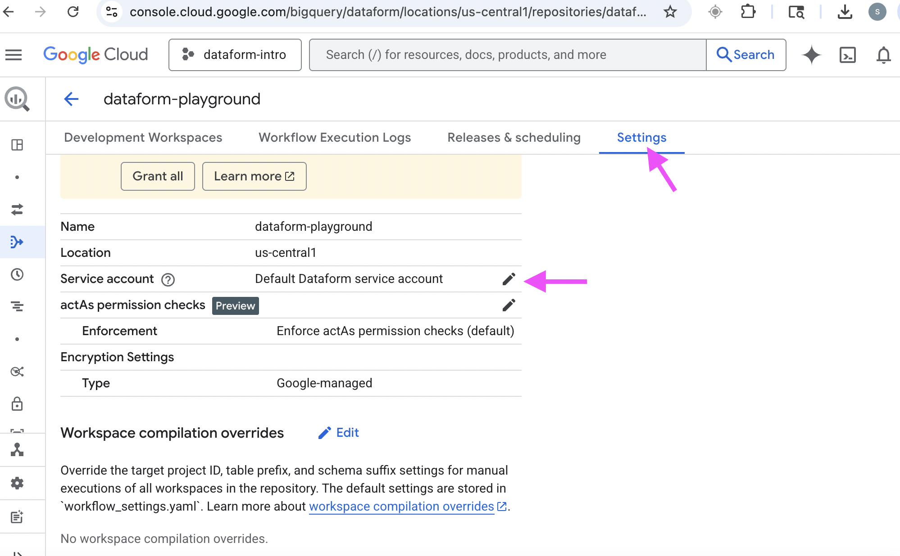

# GCP Intro / Kickstarter

Purpose: To provide an easy-to-follow walkthrough on how to configure a new GCP project for working with BigQuery and Dataform.

## Step 1: Create the GCP project

If you are creating a personal GCP project for experimentation, tinkering, practicing, etc., consider the free trial option: [https://cloud.google.com/free](https://cloud.google.com/free)

Note that no automatic charges will occur, you only start paying if you decide to activate a full, pay-as-you-go account or choose to prepay. We won't enable that during this tutorial.

Once you've signed up with GCP, you'll see "My First Project" in the top left. Click this, and then create a new project. I've named mine "dataform-intro". Switch to this project.

## Step 2: Start a Dataform repo

Navigate to the BigQuery > Dataform tool. Click "Create Repository", give it a hyphenated name (I name the repo "dataform-playground" on my instance). Choose any location for the repo.

Upon creating, you'll get a message like this:

Take a screenshot, or copy&paste the name of this service account into a notepad. If you fail to write down this ID, you can find the name of the service account by navigating to `Dataform > Your Repo > Settings tab > Edit Service Account Icon`.

Click the Edit icon to see the name:

Although GCP let us know the service account needs the `roles/bigquery.jobUser` role, it actually needs more roles to have any helpful functionality, so let's get that process started.

## Step 3: Grant permissions to service account

You can navigate to `IAM & Admin > IAM` and see the list of Principals. Then click Grant Access.

![image failed to load][Grant Access for your Dataform Service Account](./img/iam_grant_access_to_sa.png)

Enter the name of your Service Account, and it should be selected from the dropdown. Then add roles by searching and selecting them:

![image failed to load][Add roles your Dataform Service Account](./img/iam_add_roles_to_sa.png)

You will need the following roles:

- BigQuery Job User: roles/bigquery.jobUser
- BigQuery Data Editor: roles/bigquery.dataEditor
- BigQuery Data Viewer: roles/bigquery.dataViewer
- BigQuery Data Owner: roles/bigquery.dataOwner

When finished, it should look like this:

![image failed to load][Roles needed for your Dataform Service Account](./img/iam_roles_needed_for_sa.png)

You can consider other roles like:

Dataform Admin (roles/dataform.admin): For managing Dataform repositories, including creation and deletion.
Composer Worker (roles/composer.worker): If you are using Cloud Composer to schedule Dataform runs.

But we won't need these right now.

Go back to your Dataform repo.

## Step 4: Create a workspace

Dataform workspaces can be thought of as local branches of a remote repository, if Github (or other repo host) is configured.

If no external repo hub is used, Dataform has an internal default repository system.

An alternative way of using workspaces is to categorize/organize different efforts or teams, such as creating a separate workspace for data-engineering, data-analysis, and ml-models. This could also be achieved with different Dataform repos, instead of workspaces.

I've seen smaller companies (less than 800 employees, <15 data engineers & analysts) use workspaces to categorize different data efforts, and huge companies (100k+ employees) with large data teams (>50 engineers & analysts) use workspaces as personal branches, in which each workspace is an employee's name, and the workspace is used to pull & push syncs with a remote production repo hosted in Github.

Additionally, I've seen the whole concept of Dev and Prod environments become "moot" due to improper Dataform setup. In one case, a large well-known company created two separate GCP projects, one for Dev and one for Prod. Engineers worked in the Dev Dataform repo, pulling from the Prod project, then adding code, then pushing to  remote Dev, and then switching to the Prod project to pull the whole Dev repo. The manual process of pulling was annoying, so they configured it to also pull automatically every hour. This made sure that Prod always matches Dev every hour. Hilarious. No point in having a Dev environment if pushes to Dev are automatically pulled into Prod with no review.

For our walkthrough, we'll keep it simple. Name the workspace whatever you like, we'll only use 1 workspace with default settings.

Then in your empty workspace, you'll see the option to initialize it.

Click the button to initialize.

You'll now have a basic folder structure.

## Step 5: Return to the Dataform tutorial

Now you're halfway through Step 1 on the [Dataform Turorial Readme](README.md). Go there and continue your learning journey!
